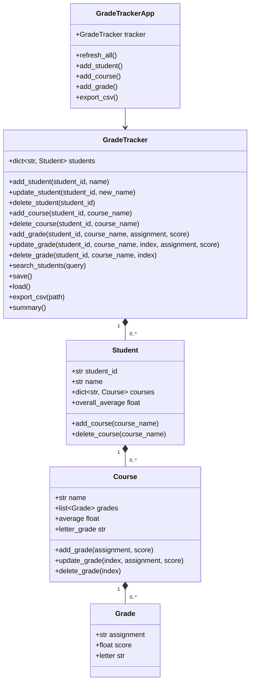

# Class Diagram

```mermaid
classDiagram
    class Grade {
        +str assignment
        +float score
        +letter str
    }

    class Course {
        +str name
        +list~Grade~ grades
        +add_grade(assignment, score)
        +update_grade(index, assignment, score)
        +delete_grade(index)
        +average float
        +letter_grade str
    }

    class Student {
        +str student_id
        +str name
        +dict~str, Course~ courses
        +add_course(course_name)
        +delete_course(course_name)
        +overall_average float
    }

    class GradeTracker {
        +dict~str, Student~ students
        +add_student(student_id, name)
        +update_student(student_id, new_name)
        +delete_student(student_id)
        +add_course(student_id, course_name)
        +delete_course(student_id, course_name)
        +add_grade(student_id, course_name, assignment, score)
        +update_grade(student_id, course_name, index, assignment, score)
        +delete_grade(student_id, course_name, index)
        +search_students(query)
        +save()
        +load()
        +export_csv(path)
        +summary()
    }

    class GradeTrackerApp {
        +GradeTracker tracker
        +refresh_all()
        +add_student()
        +add_course()
        +add_grade()
        +export_csv()
    }

    Course "1" *-- "0..*" Grade
    Student "1" *-- "0..*" Course
    GradeTracker "1" *-- "0..*" Student
    GradeTrackerApp --> GradeTracker
```
